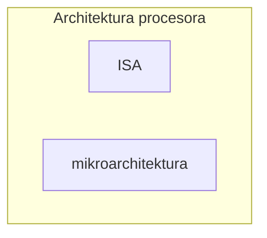

^1e049c

[[Mikroarchitektura]]
[[Model programowy]]

# Atrybuty architektury
- Zbiór instrukcji
- Dostępne rejestry
- Typy i rozmiary operandów
- Tryby adresowania 
- Instrukcje sterowania przepływem
- Kodowanie instrukcji
- Alignment (wyrównywanie) adresów
- Klasy odwołań do pamięci ([[Register-memory architecture]], [[Load-store architecture]])