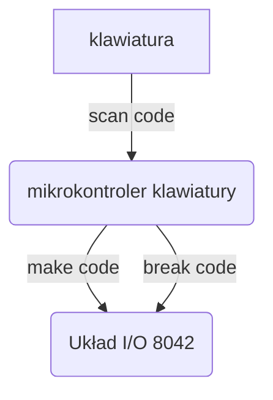

[[AKO_2024_cz_4.pdf#page=29]]

- Każdy fizyczny klawisz ma przypisany *scan code*. ^scan-code
- Klawiatura generuje *make code* na wciśnięcie i *break code* na puszczenie.
- `break code = F0h, make code`

[[Urządzenia zewnętrzne#Układ wejścia/wyjścia (Układ pośredniczący)]]
[Wikipedia: Intel MCS-48](https://en.wikipedia.org/wiki/Intel_MCS-48) ([[Urządzenia zewnętrzne#Układy współadresowalne]])

---
# Realizacja techniczna
## Skanowanie klawiatury
![[#^scan-code]]

Klawiatura periodycznie skanuje *matrycę klawiszy*. Jeśli na dany rząd poda się `0` (niskie napięcie) i w pewnej kolumnie też będzie `0`, to klawisz na przecięciu był wtedy wciśnięty.

Obecność `0`-a sprawdza się za pomocą *multipleksera*. Mikroprocesor zmienia adresowanie na multiplekserze by sprawdzić, czy na którymś pinie wejściowym aby nie ma `0`. Jeśli jest, to mikroprocesor wie, który rząd i którą kolumnę właśnie sprawdził i stwierdza wciśnięcie klawisza.

> [[AKO_2024_cz_4.pdf#page=35|Kabelki]]

