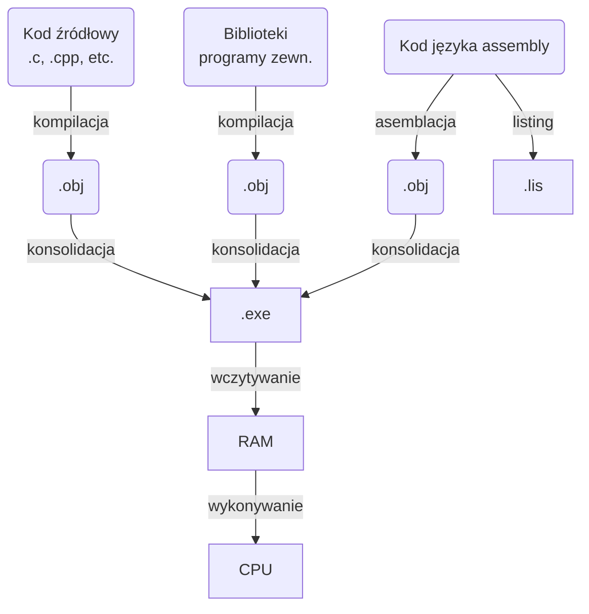

```mermaid
flowchart

asm(Kod języka assembly)
src(Kod źródłowy <br> .c, .cpp, etc.)
lib(Biblioteki <br> programy zewn.)

direction LR
src --kompilacja--> obj1(.obj)
lib --kompilacja--> obj2(.obj)
asm --asemblacja--> obj3(.obj)

direction LR
obj1 --konsolidacja--> .exe
obj2 --konsolidacja--> .exe
obj3 --konsolidacja--> .exe
asm --listing--> .lis

direction TB
.exe --wczytywanie--> RAM
RAM --wykonywanie--> CPU

```
# [[Kompilacja]]
![[Kompilacja#^5d4ed4]]

# Asemblacja, czyli [[Kodowanie instrukcji]]