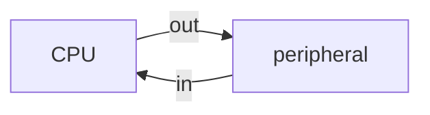

# Układ wejścia/wyjścia (Układ pośredniczący)

^2fcc31

![[AKO_2024_cz_4.pdf#page=6]]

## Rejestry Układu I/O
1. Rejestr stanu urządzenia
2. Rejestr sterujący ^[Urządzenie dostaje [[#Przerwanie systemowe]] przy wpisaniu do rejestru stanu. Jest wtedy używany jako sterujący.]
3. Rejestr danych wysyłanych *do urządzenia*
4. Rejestr danych odbieranych *z urządzenia*
### Układy współadresowalne
- Rejestry są wyeksponowane w pamięci RAM. 
> Tak działa [[Tryb tekstowy]] i [[Tryb graficzny]].
### Izolowane wejście-wyjście
- Rejestry dostępne w dedykowanej *przestrzeni adresowej portów*.

>[!Warning] Sterowanie peryferiami to zadanie OS-a!
>Próby manipulacji rejestrami urządzeń bez użycia [[Przerwanie systemowe]] skończy się terminacją programu.
# Direct Memory Access (DMA)
Komunikacja z peryferiami bez udziału procesora. Procesor najpierw upoważnia **sterownik DMA** do pośredniczenia między RAM-em a układem I/O:
## Inicjalizacja DMA
1. Do **rejestru adresu** sterownika wpisujemy początek przesyłanego obszaru
2. Do **licznika** sterownika - długość obszaru
... i sterownik kopiuje sobie dane.

Po zakończonej wymianie danych procesor otrzymuje tylko [[Przerwanie systemowe]].
## [[Najważniejsze instrukcje]]: `IN` `OUT`
Służą do dostępu do pamięci urządzenia w *przestrzeni portów*. Są chronione i dostępne tylko dla autoryzowanych programów.
Z zewnątrz wykorzystujemy [[Przerwanie systemowe]] które jest zaimplementowane za pomocą instrukcji chronionych.
Użycie: `in al, 60h` "wczytaj z rejestru sprzętowego do al"

> [[AKO_2024_cz_4.pdf#page=25|Przykład użycia]] do zmiany [[Tryb graficzny|palety trybu 13h]].

# [[Przerwanie systemowe]]
Stanowi alternatywę dla [[Polling|odpytywania]] urządzenia o stan. Zamiast tego dostajemy *powiadomienie* że urządzenie jest gotowe na naszą uwagę.

>[!info]- Sprawdzanie dostępnych [[#Układ wejścia/wyjścia (Układ pośredniczący)]] i [[#Przerwanie systemowe]] w systemie Windows
>![[AKO_2024_cz_4.pdf#page=10]]

# [[Obsługa klawiatury]]