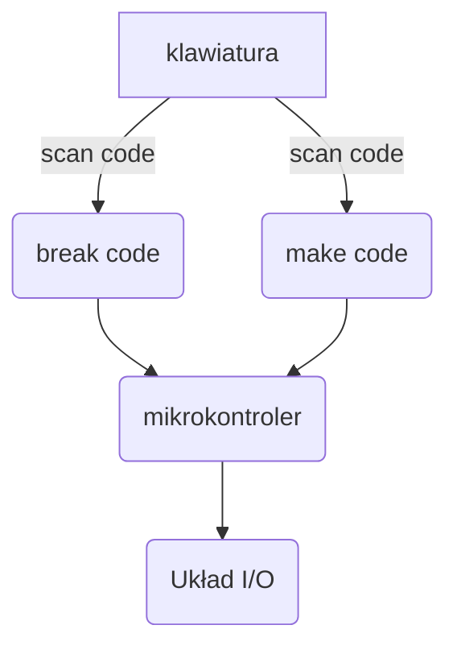

# Układ wejścia/wyjścia (Układ pośredniczący)

^2fcc31

![[AKO_2024_cz_4.pdf#page=6]]

**Rejestry** urządzenia to wyróżnione w dokumentacji komórki pamięci urządzenia:
1. Rejestr stanu urządzenia
2. Rejestr sterujący ^[Urządzenie dostaje [[#Przerwanie systemowe]] przy wpisaniu do rejestru stanu. Jest wtedy używany jako sterujący.]
3. Rejestr danych wysyłanych *do urządzenia*
4. Rejestr danych odbieranych *z urządzenia*

## [[Najważniejsze instrukcje]]: `IN` `OUT`
Służą do dostępu do pamięci urządzenia w *przestrzeni portów*. Są chronione i dostępne tylko dla autoryzowanych programów.
Z zewnątrz wykorzystujemy [[Funkcja systemowa]] (np. [[Najważniejsze instrukcje#INT]]) która jest zaimplementowana za pomocą instrukcji chronionych.
Użycie: `in al, 60h` "wczytaj do al"

# [[Przerwanie systemowe]]
Stanowi alternatywę dla [[Polling|odpytywania]] urządzenia o stan. Zamiast tego dostajemy *powiadomienie* że urządzenie jest gotowe na naszą uwagę.

>[!info]- Sprawdzanie dostępnych [[#Układ wejścia/wyjścia (Układ pośredniczący)]] i [[#Przerwanie systemowe]] w systemie Windows
>![[AKO_2024_cz_4.pdf#page=10]]

# 
---

# Tryb tekstowy
Poczynając od adresu `000B8000` (znak w $(0,0)$) ([[Tryby adresowania#Fizyczny]])
![[AKO_2024_cz_4.pdf#page=12]]
W bajcie atrybutu:
- m : migotanie
- i : #todo

## [[Rejestry]] segmentowe
![[AKO_2024_cz_4.pdf#page=14]]

# Tryb graficzny
![[AKO_2024_cz_4.pdf#page=16]]

# Obsługa klawiatury

