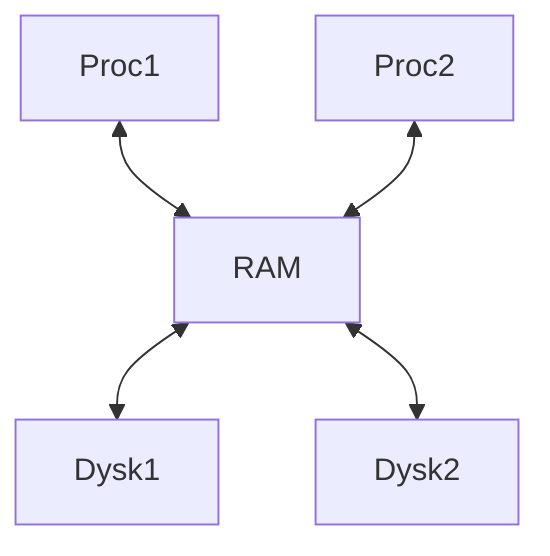

# Pamięć współdzielona 

```mermaid
flowchart
Proc1 <--> RAM
Proc2 <--> RAM
RAM <--> Dysk1
RAM <--> Dysk2
```
# Dyski współdzielone 
- Każdy procesor ma swoją pamięć operacyjną
- Brak konfliktów
# Nic nie współdzielone
- Procesory dzielą tylko *medium komunikacyjne*