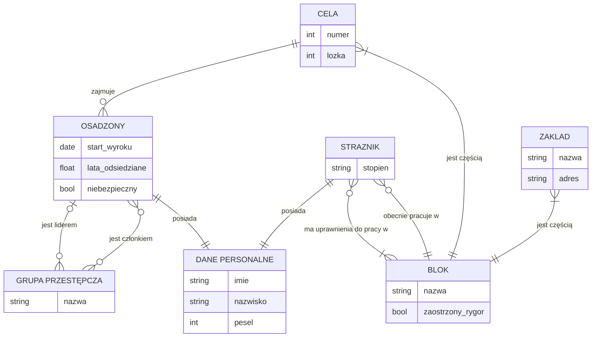

# ERD

# Dokument
[Overleaf](https://www.overleaf.com/project/6700f2814915a287f52c9e74)
[dbdiagram.io](https://dbdiagram.io/d/Wiezienie-6713536097a66db9a3875c57) ^56826c

Jeżeli zabraknie encji:
dodać pole "zwolnienie warunkowe" do więźnia, dodać transakcję biznesową "wniosek o zwolnienie" czy coś między więźniem a pracownikiem administracyjnym. Uwaga: utrudni to zapis początku i końca wyroku.