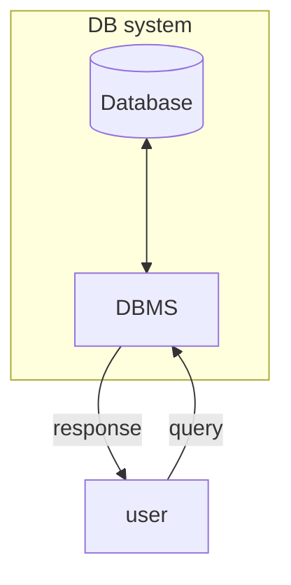

---
aliases:
  - System Bazy Danych
  - DBS
---
# Elementy systemu
- external storage
	który musi być *permanentny* oraz *reliable* 
- [[Database Management System]]
- [[Język zapytań]]

# Diagram

Zobacz: [[Użytkownik|User]], [[Database Management System|DBMS]]
# Poziomy modelu architektury
1. External (user)
> Wyeksponowane funkcje DBS.
3. Logical (model)
> Widać struktury danych z perspektywy modelu logicznego. Poziom dostępny dla admina.
3. Internal (physical) level
> Poziom implementacyjny.
