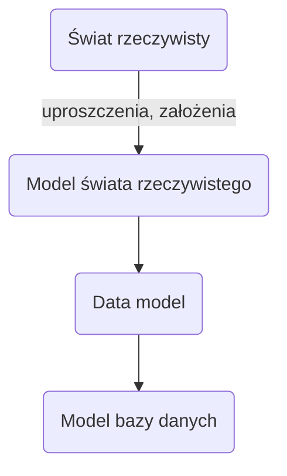

---
aliases:
- ERM
---

```mermaid
flowchart

ERD("Model świata rzeczywistego")

WRLD("Świat rzeczywisty") --"uproszczenia, założenia"--> ERD
ERD --> DM("Data model")
DM --> DBM("Model bazy danych")

```
# Świat rzeczywisty 
# Model świata rzeczywistego
[[Bazy Danych Projekt#ERD]], [[Encja]], [[Związek]]
# Model bazy danych
[[Relacja]]