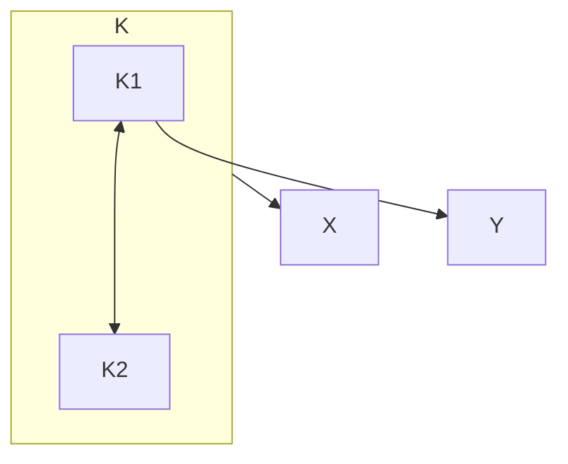
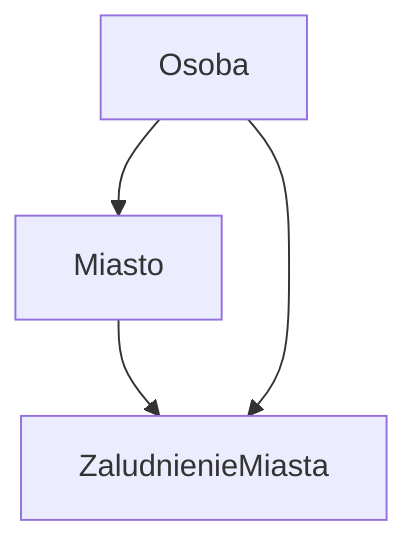

---
aliases:
  - NF
  - Normal Form
---
Opisują **zależności** między [[Encja#Atrybut|atrybutami]]. Zastosowanie to przede wszystkim znajdowanie [[Redundancja|redundancji]].
# 1NF
~~Brakujące w prezentacji~~
# 2NF
Złamana gdy istnieje zależność od tylko jednej składowej klucza złożonego.

# 3NF
Złamana gdy istnieje zależność przechodnia.

# Boyce-Codd NF
Złamana gdy istnieje *wyznacznik* niebędący jednym z *kluczy kandydujących.*
Wyznaczniki to wszystkie atrybuty, od których zależy jakiś inny.

# 4NF
Nie posiada zależności wielowartościowych, tzn. każdy wyznacznik jednoznacznie wskazuje na *jedną* możliwą wartość atrybutu.
