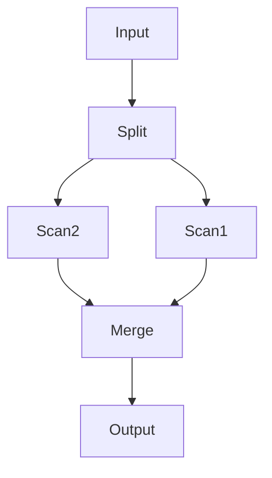

# Parametry
Ile czasu potrzebuje system powiększony n-krotnie na...
- Przyspieszenie - ×n więcej zapytań
- Skalowalność - ×n większe zadanie
- Skalowalność transakcyjna - ×n zapytań od ×n użytkowników (n²)

# 
---

## Paralelizm potokowy
Każdy procesor wykonuje inną część kwerendy, +złączanie
## Paralelizm partycjonowany
*Fragmentacja pozioma*

[[Diagram przepływu danych]]

# [[Ograniczenia równoległości]]