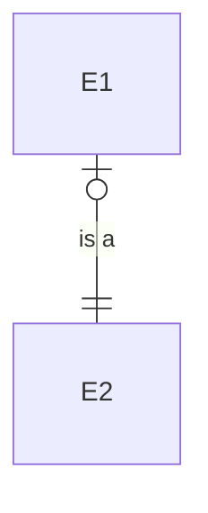

---
aliases:
  - Relationship
---
>[!warning] Związek ≠ [[Relacja]]!
>Pomimo że zachowuje się analogicznie do relacji (krotki) w rozumieniu matematyki dyskretnej.

Związek to zbiór tupli encji.

Związki binarne (związki dwóch encji) modeluje się za pomocą [[Bazy Danych Projekt#ERD|Entity Relationship Diagram]].
Związki niebinarne w procesie modelowania redukuje się do związków binarnych. Związek wyższych stopni staje się własną encją (*transakcją biznesową*). Często modelowana jako *gwiazda* (ma tylko jedynki, ale wiele encji ją ma).
# Związek is-a
Działa jak dziedziczenie.
E1 is-a E2 <=> E1 jest w podzbiorze E2

Encja dziedzicząca *może dziedziczyć [[Encja#Klucz]]*.