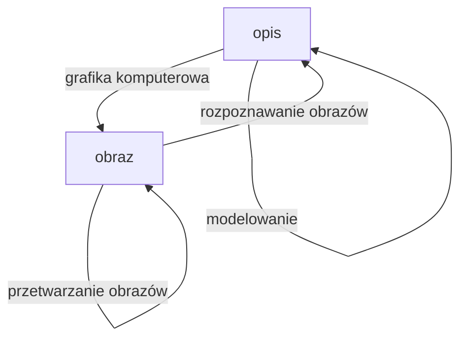

# Grafika komputerowa
- Komunikacja z człowiekiem (interfejs)
- Diagramy, grafy
- Modelowanie kształtów, rysunki techniczne
- Publikacja
- Kartografia
- CGI, VFX
- Wizualizacja abstrakcyjnych zjawisk
- Animacja
- Plastyka (duh)
# Rozpoznawanie obrazów
- Opis
- Klasyfikacja
- Porównywanie
- Analiza materiałów/struktur
# Przetwarzanie obrazów
- Dyskretyzacja
- Poprawa jakości
- Rekonstrukcja
- Kompresja
- Wyodrębnianie obiektów (kluczowanie)
- Upraszczanie kształtów 